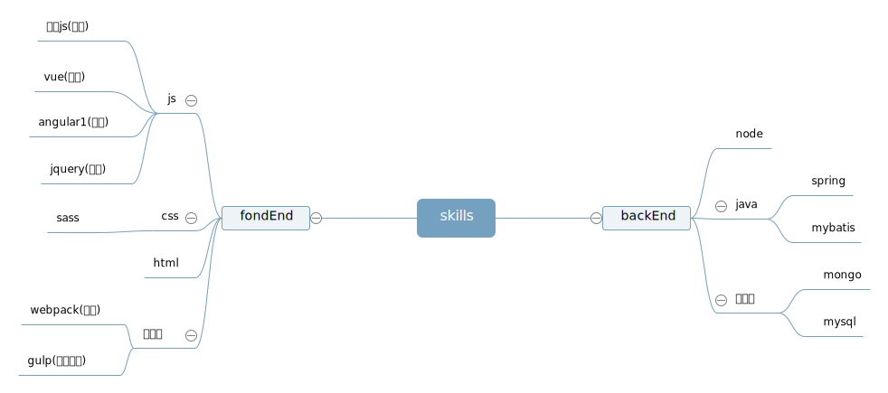

## 个人信息
+ 葛瑞兵
+ 本科/南京工业大学/制药工程
+ 工作年限：一年半(算实习)
+ 期望岗位：前端开发工程师
+ github: [https://github.com/wlxscn](https://github.com/wlxscn)

## 技能树

## 工作经历

### 上海云砺信息有限公司(2017-2 ~ 至今)
#### 票易通3.0前端上线与维护
> 技术栈：sass,vue,vuex,vue-router,webpack,node

*项目介绍：* 票易通平台是一个为第三方企业提供在线开票的系统平台，现已成功上线，多家企业在使用中

*主要职责：* 来到公司后主要负责销项结算单，销项发票两个模块的开发与维护，并负责整个项目一些公共组件的开发。
            刚来公司不久，由于之前的老大离职，几乎负责了整个项目与后台接口的对接，协助其他同事解决遇到的一些问题。
            其他方面，由于这是一个基于vue的多页面的项目，后期自己通过学习webpack相关的知识，利用webpack完成了整个项目的打包构建，以及做了一些打包优化方面的工作。

### 上海趣医网(2016-7~2017-2)
#### 后台业务系统部分模块的开发
> 技术栈: angular,bootstrap,spring,mybatis,mysql,mongo

*项目介绍：* 后台业务系统主要是为趣医官网提供数据维护的一套系统。

*主要职责：* 主要负责的是医院科室医生数据的模块，独立完成了整个系统的部分功能的前后台任务。
            逻辑虽然是很简单的CRUD,但这段经历让我对前后端的交互有了更深的认识。

### 南京梯云纵信息有限公司(2015-11~2016-4)
#### 移动分销项目
> 技术栈: jquery,apiclould

*项目介绍：* 是一个给供货商服务的一个外包项目

*主要职责：* 利用jquery和baidu template以及apiclould负责了部分移动端页面的开发

## 技能关键字
+ js基础还可以，平时简单使用es6相关的知识
+ 熟练使用vue,angular1，对react了解做过一些简单的demo
+ 简单使用webpack,gulp等自动化，打包工具
+ 了解node,做过简单的demo;简单使用java，对数据库知识能简单的使用

## 个人评价

### 优点
喜欢研究一些新的知识
喜欢逛一些技术社区，利用碎片化的时间会逛想掘金，知乎,sg,github等技术社区

### 缺点
比较懒，很多东西看了就遗忘了，不喜欢写文章，github没有个人项目。。。

           
